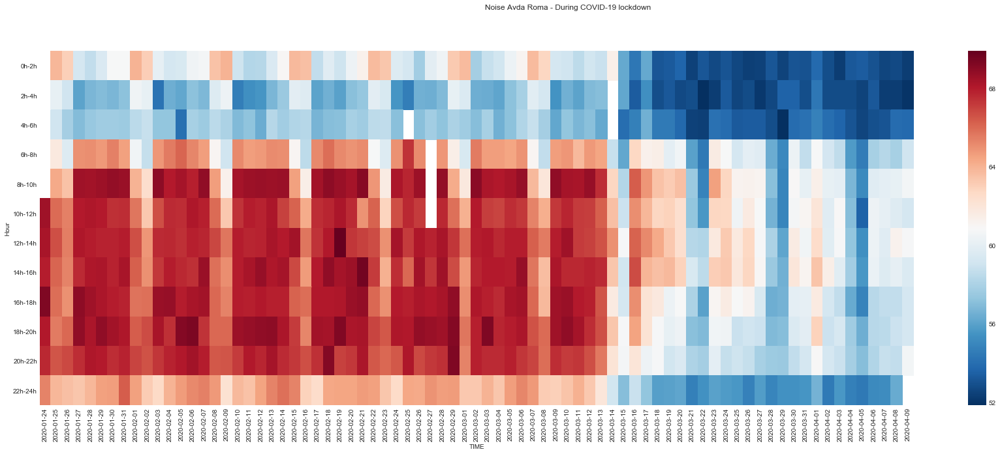

Smart Citizen Data
=======

[](https://zenodo.org/badge/latestdoi/97752018)
[](https://mybinder.org/v2/gh/fablabbcn/smartcitizen-data-framework/master?filepath=%2Fexamples%2Fnotebooks)
[](https://badge.fury.io/py/scdata)

Welcome to **SmartCitizen Data**. This is a data analysis framework built with many purposes, such as:

 - *Analysis*, *calibration* and *post-processing* of sensor data for development or performance assessment
 - *Unify* several sources of data and to *provide tools* for analysis in a standard way
 - *Tidy up* sensor data and allow for **traceability** of results and conclusions, and **reproducibility**
 - *Create visualisations* and reports in html format or print them as pdf


## Features



Some examples in this repository include:

- Interacting with several sensors APIs
- Clean data, export and calculate metrics
- Model sensor data and calibrate sensors
- Generate data visualisations
- Generate analysis reports and upload them to [Zenodo](http://zenodo.org)


A full documentation of the framework is detailed in [the Smart Citizen Docs](https://docs.smartcitizen.me/Data%20Analysis/). 

## Funding

This work has received funding from the European Union's Horizon 2020 research and innovation program under the grant agreement [No. 689954](https://cordis.europa.eu/project/rcn/202639_en.html)

## Compatibility

Works with `Python 3.*`.

## Installation

You can check it out in the [](https://mybinder.org/v2/gh/fablabbcn/smartcitizen-data-framework/master?filepath=%2Fexamples%2Fnotebooks) before installing if you want.

You can just run:

```
pip install scdata
```

### Work on the source code

Simply clone the repository with:

```
git clone https://github.com/fablabbcn/smartcitizen-data-framework.git
cd smartcitizen-data-framework
```

Install `scdata` package with requirements:

```
python setup.py install
```

Or if you want to edit:

```
cd scdata
pip install --editable .
```

### Tokens and config

If you want to upload data to [Zenodo](http://zenodo.org), you will need to fill set an environment variable called `ZENODO_TOKEN` in your environment. You can get more instructions [here](https://docs.smartcitizen.me/Guides/data/Upload%20data%20to%20zenodo/) and with [this example](https://github.com/fablabbcn/smartcitizen-data/blob/master/examples/notebooks/06_upload_to_zenodo.ipynb).

A configuration file is available at `~/.config/scdata/config.yaml`, which contains a set of configurable variables to allow or not the local storage of relevant data in the data folder, normally in `~/.cache/scdata/data`:

```
data:
  cached_data_margin: 2
  load_cached_api: true
  reload_firmware_names: true
  store_cached_api: true
paths:
  config: /Users/username/.config/scdata
  data: /Users/username/.cache/scdata
  export: /Users/username/.cache/scdata/export
  interim: /Users/username/.cache/scdata/interim
  inventory: ''
  models: /Users/username/.cache/scdata/models
  processed: /Users/username/.cache/scdata/processed
  raw: /Users/username/.cache/scdata/raw
  reports: /Users/username/.cache/scdata/reports
  uploads: /Users/username/.cache/scdata/uploads
zenodo_real_base_url: https://zenodo.org
zenodo_sandbox_base_url: http://sandbox.zenodo.org
```

### Using with Jupyterlab (optional)

It can also be used with `jupyterlab` or `jupyter`. For this [install juypterlab](https://github.com/jupyterlab/jupyterlab) and (optionally), these extensions:

1. Notebook extensions configurator:

```
pip install jupyter_nbextensions_configurator
```

2. Plotly in jupyter lab (interactive plots):

```
jupyter labextension install jupyterlab-plotly
```

If using this option, examples on how to generate automatic reports from `jupyter notebooks` are also given in the examples folder.

## Contribute

Issues and PR more than welcome!
